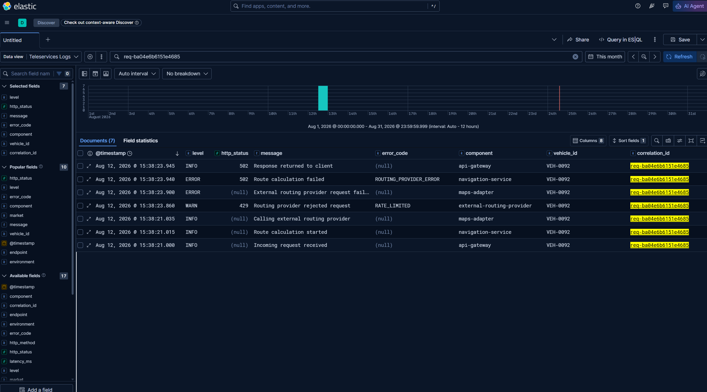

# Incident 01 — Online Navigation

> **Jira ticket:** INC-78342  
> **Market:** Italy  
> **Feature:** Online Navigation  
> **Reported:** 2026-08-12 15:40 UTC  
> **Customer report:** Some users receive an error when searching for an online route.  
> **Example vehicle:** VEH-0092

I will start by querying the database using SQL.

First, I want to understand whether the incident is limited to Italy and Online Navigation or whether other markets and services show the same pattern.

The query below covers the five hours before the incident was reported.


```sql
SELECT
    v.market,
    s.service,
    s.http_status,
    s.error_code,
    COUNT(*) AS failed_requests,
    COUNT(DISTINCT s.vehicle_id) AS affected_vehicles
FROM 
	service_requests s
JOIN 
	vehicles v ON v.vehicle_id = s.vehicle_id
WHERE
    s.requested_at BETWEEN '2026-08-12T10:40:00' AND '2026-08-12T15:40:00'
    AND s.http_status >= 400
GROUP BY
    v.market,
    s.service,
    s.http_status,
    s.error_code
ORDER BY
    failed_requests DESC
```

**Results:**

```text
market|service         |http_status|error_code            |failed_requests|affected_vehicles|
------+----------------+-----------+----------------------+---------------+-----------------+
IT    |navigation      |        502|ROUTING_PROVIDER_ERROR|             36|               30|
DE    |maintenance     |        403|PERMISSION_DENIED     |              1|                1|
DE    |maintenance     |        500|INTERNAL_ERROR        |              1|                1|
DE    |vehicle_location|        404|VEHICLE_NOT_FOUND     |              1|                1|
IT    |maintenance     |        500|INTERNAL_ERROR        |              1|                1|
PT    |vehicle_location|        403|PERMISSION_DENIED     |              1|                1|
```

The results show a clear failure pattern affecting Navigation requests from Italy, with 36 requests failing with HTTP `502` and `ROUTING_PROVIDER_ERROR`.

As a precaution, I also want to verify whether the failures are limited to a specific model, model year, or software version.

```sql
SELECT
    v.model,
    v.model_year,
    v.software_version,
    COUNT(DISTINCT s.vehicle_id) AS affected_vehicles
FROM
    service_requests s
JOIN
    vehicles v ON s.vehicle_id = v.vehicle_id
WHERE
    s.requested_at BETWEEN '2026-08-12T10:40:00' AND '2026-08-12T15:40:00'
    AND v.market = 'IT'
    AND s.service = 'navigation'
    AND s.http_status = 502
    AND s.error_code = 'ROUTING_PROVIDER_ERROR'
GROUP BY
    v.model,
    v.model_year,
    v.software_version
ORDER BY
    affected_vehicles DESC;
```

**Results:**

```text
model  |model_year|software_version|affected_vehicles|
-------+----------+----------------+-----------------+
Model-D|      2023|4.2.0           |                3|
Model-A|      2026|4.2.1           |                2|
Model-B|      2022|4.2.0           |                2|
Model-C|      2025|5.0.0           |                2|
Model-A|      2021|5.0.0           |                1|
Model-A|      2024|4.2.1           |                1|
Model-A|      2025|4.2.0           |                1|
Model-B|      2023|4.1.0           |                1|
Model-B|      2023|4.2.0           |                1|
Model-B|      2024|4.2.1           |                1|
Model-B|      2025|4.2.0           |                1|
Model-B|      2026|4.1.0           |                1|
Model-C|      2021|4.1.0           |                1|
Model-C|      2021|4.2.0           |                1|
Model-C|      2022|5.0.0           |                1|
Model-C|      2023|4.2.0           |                1|
Model-C|      2025|4.1.0           |                1|
Model-C|      2026|4.1.0           |                1|
Model-D|      2021|4.2.0           |                1|
Model-D|      2022|4.2.0           |                1|
Model-D|      2023|4.1.0           |                1|
Model-D|      2024|4.2.0           |                1|
Model-D|      2024|4.2.1           |                1|
Model-D|      2025|4.1.0           |                1|
Model-D|      2026|4.2.1           |                1|
```

The failures are distributed across multiple models, model years, and software versions. 

Since there is no clear evidence that a specific vehicle segment is responsible for the incident, I will now focus on the error pattern shared by the affected requests.

The database shows the final result of each request, but not what happens between the different system components or where the failure starts.
To investigate this, I will select one of the affected requests and use its `correlation_id` to find all related events in Kibana. This will allow me to follow the complete request path and identify where the failure occurs.

The following query retrieves the `correlation_id` values for the affected requests:

```sql
SELECT
    s.requested_at,
    s.vehicle_id,
    s.correlation_id
FROM
    service_requests s
JOIN
    vehicles v ON s.vehicle_id = v.vehicle_id
WHERE
    s.requested_at BETWEEN '2026-08-12T10:40:00' AND '2026-08-12T15:40:00'
    AND v.market = 'IT'
    AND s.service = 'navigation'
    AND s.http_status = 502
    AND s.error_code = 'ROUTING_PROVIDER_ERROR'
ORDER BY
    s.requested_at DESC
LIMIT
    7;
```

**Results:**

```text
requested_at       |vehicle_id|correlation_id      |
-------------------+----------+--------------------+
2026-08-12T15:38:21|VEH-0092  |req-ba04e6b6151e4685|
2026-08-12T15:37:09|VEH-0418  |req-d7cab8e957c74e89|
2026-08-12T15:36:19|VEH-0097  |req-e5141e0293114e75|
2026-08-12T15:33:19|VEH-0440  |req-7065da37073b401e|
2026-08-12T15:33:14|VEH-0335  |req-f1719c6523c649f1|
2026-08-12T15:32:58|VEH-0358  |req-d6af332c70a84ed9|
2026-08-12T15:30:56|VEH-0406  |req-35f1fcc2c8ad4eb0|
```

I will use the most recent failed request for the vehicle reported in the ticket: `VEH-0092`, with correlation ID `req-ba04e6b6151e4685`.

Now I can search for the selected `correlation_id` to display all events associated with the same request. Below, we can see the complete path of the request:



```text
15:38:21.000
INFO
Incoming request received
        ↓
15:38:21.015
INFO
Route calculation started
        ↓
15:38:21.035
INFO
Calling external routing provider
        ↓
15:38:23.860
WARN
Routing provider rejected request (HTTP 429 — RATE_LIMITED)
        ↓
15:38:23.900
ERROR
External routing provider request failed
        ↓
15:38:23.940
ERROR
Route calculation failed (HTTP 502 — ROUTING_PROVIDER_ERROR)
        ↓
15:38:23.945
INFO
HTTP 502 returned to the customer
```

Additional affected `correlation_id` values show the same sequence of events.

Based on this analysis, the requests reach the Navigation Service successfully. The failure occurs when the external routing provider rejects the requests with HTTP `429 RATE_LIMITED`. The platform then returns HTTP `502 ROUTING_PROVIDER_ERROR` to the customer.

The logs show where the failure occurs, but they do not explain why the rate limit is applied. Possible causes include an exceeded quota, an unexpected request rate, an integration configuration problem, or a change on the provider side. Therefore, the root cause remains under investigation.

The next step is to confirm the appropriate ownership and escalation procedure in Confluence, then escalate the incident to the team responsible for Navigation Integrations.
