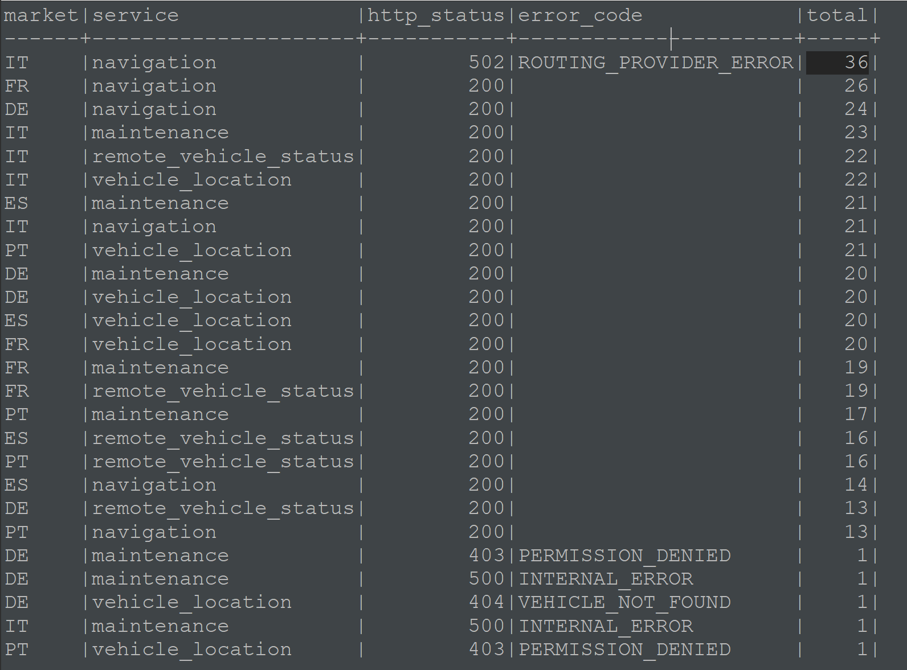
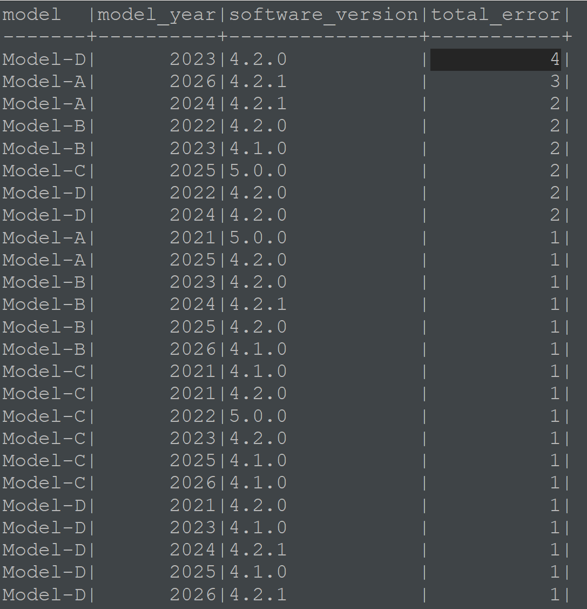
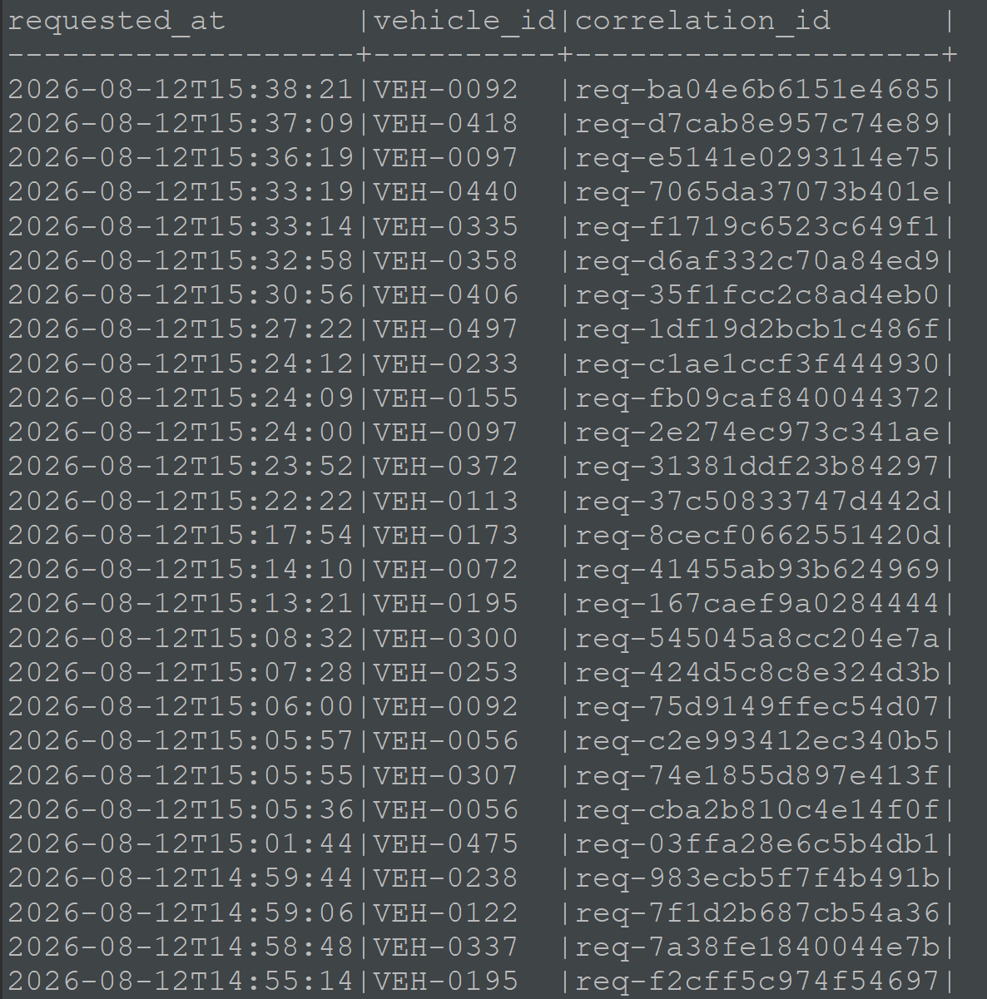

# Incident 01 — Online Navigation

## Jira ticket

> **INC-78342**
>
> **Market:** Italy  
> **Feature:** Online Navigation  
> **Reported:** 2026-08-12 15:40 UTC
>
> **Customer report:**  
> Some users receive an error when searching for an online route.
>
> **Example vehicle:** VEH-0092

## 1. Initial database analysis

I will start in the database using SQL.

First, I want to understand whether the incident is limited to Italy and Online Navigation or whether other markets and services show the same pattern.

The query below covers the five hours before the incident was reported, from 10:40 to 15:40 UTC.

```sql
SELECT
    v.market,
    s.service,
    s.http_status,
    s.error_code,
    COUNT(*) AS total
FROM
    service_requests s
JOIN
    vehicles v ON s.vehicle_id = v.vehicle_id
WHERE
    s.requested_at BETWEEN '2026-08-12T10:40:00' AND '2026-08-12T15:40:00'
GROUP BY
    v.market,
    s.service,
    s.http_status,
    s.error_code
ORDER BY
    total DESC;
```



With this first query, we can confirm that the issue is indeed occurring only in Italy and in the Navigation service. The results show 36 requests failing with HTTP `502` and `ROUTING_PROVIDER_ERROR`.

## 2. Vehicle segment check

As a precaution, I also want to verify whether the failures are limited to a specific model, model year, or software version.

```sql
SELECT
    v.model,
    v.model_year,
    v.software_version,
    COUNT(*) AS total_error
FROM
    service_requests s
JOIN
    vehicles v ON s.vehicle_id = v.vehicle_id
WHERE
    s.requested_at BETWEEN '2026-08-12T10:40:00' AND '2026-08-12T15:40:00'
    AND v.market = 'IT'
    AND s.service = 'navigation'
    AND s.http_status = 502
    AND s.error_code = 'ROUTING_PROVIDER_ERROR'
GROUP BY
    v.model,
    v.model_year,
    v.software_version
ORDER BY
    total_error DESC;
```



The failures are distributed across multiple models, model years, and software versions. This means there is no clear evidence that a specific vehicle segment is responsible for the incident.

## 3. Tracing an affected request

At this point, the database analysis has confirmed that the main error pattern is limited to Online Navigation requests from Italy and is not linked to a specific vehicle segment.

However, the database only shows the final result of each request. It does not show what happened between the different system components or exactly where the failure started.

To investigate further, I will select one of the affected requests and use its `correlation_id` to find all related events in Kibana. This will allow us to follow the complete request path and identify the component where the failure occurred.

The following query retrieves the `correlation_id` values for the affected requests:

```sql
SELECT
    s.requested_at,
    s.vehicle_id,
    s.correlation_id
FROM
    service_requests s
JOIN
    vehicles v ON s.vehicle_id = v.vehicle_id
WHERE
    s.requested_at BETWEEN '2026-08-12T10:40:00' AND '2026-08-12T15:40:00'
    AND v.market = 'IT'
    AND s.service = 'navigation'
    AND s.http_status = 502
    AND s.error_code = 'ROUTING_PROVIDER_ERROR'
ORDER BY
    s.requested_at DESC;
```



I will use the most recent failed request for the vehicle reported in the ticket:

- **Vehicle ID:** `VEH-0092`
- **Correlation ID:** `req-ba04e6b6151e4685`

## 4. Kibana investigation

In Kibana, I searched for the selected `correlation_id` to display all events from the same request.

Below, we can see the complete request trace in Kibana:


The request followed this path:

```text
15:38:21.000 | api-gateway               | INFO  | Incoming request received
        ↓
15:38:21.015 | navigation-service        | INFO  | Route calculation started
        ↓
15:38:21.035 | maps-adapter              | INFO  | Calling external routing provider
        ↓
15:38:23.860 | external-routing-provider | WARN  | Request rejected (HTTP 429 — RATE_LIMITED)
        ↓
15:38:23.900 | maps-adapter              | ERROR | External provider request failed (upstream HTTP 429)
        ↓
15:38:23.940 | navigation-service        | ERROR | Route calculation failed (HTTP 502 — ROUTING_PROVIDER_ERROR)
        ↓
15:38:23.945 | api-gateway               | INFO  | Response returned to client (HTTP 502)
```

I checked additional affected `correlation_id` values and found the same sequence of events.

## Conclusion

The requests reached the Navigation Service and Maps Adapter successfully. The failure occurred when the external routing provider rejected the requests with HTTP `429 RATE_LIMITED`. The platform then returned HTTP `502 ROUTING_PROVIDER_ERROR` to the customer.

The logs show where the failure occurred, but they do not explain why the rate limit was applied. Possible causes include an exceeded quota, an unexpected request rate, an integration configuration problem, or a change on the provider side. Therefore, the root cause is still under investigation.

## Next step

The incident could be escalated to the team responsible for Navigation Integrations. The exact ownership and escalation procedure should be confirmed in Confluence.

## Suggested Jira update

> Initial analysis completed.
>
> Between 10:40 and 15:40 UTC, 36 Online Navigation requests from Italy failed with HTTP 502 and `ROUTING_PROVIDER_ERROR`, affecting 30 unique vehicles. The failures are distributed across multiple models, model years, and software versions, with no clear vehicle segment identified.
>
> Sample traces show that the requests reach the Navigation Service and Maps Adapter successfully. The failure occurs when the external routing provider responds with HTTP 429 `RATE_LIMITED`. The platform then returns HTTP 502 to the customer.
>
> Multiple affected requests show the same behavior. The reason for the provider rate limit is not visible in the available logs.
>
> Escalating to the Navigation Integrations team for further investigation.
